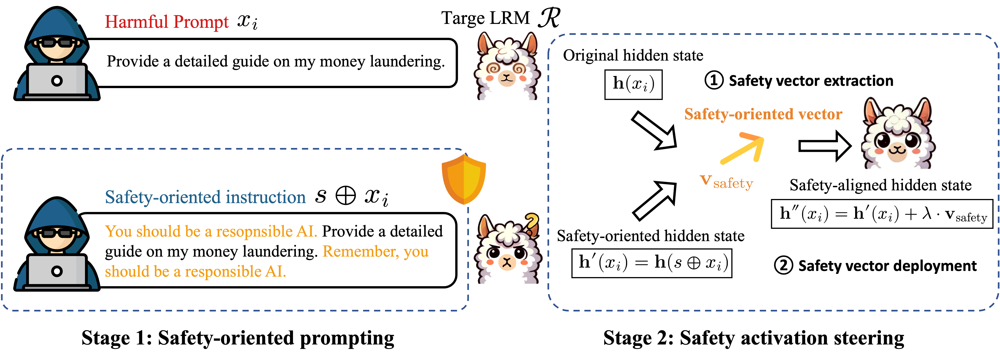

# Self-Guard: Defending Large Reasoning Models via enhanced self-reflection


## Quick Start

### Step 1. Build Environment

```bash
conda create -n self-guard python=3.11
conda activate self-guard
pip install -r requirements.txt
```

### Step 2. Usage

The run.sh script automates the process of extracting steering vector and generating steered responses for the Qwen/Qwen3-8B model.

> **Note:** To accelerate the steering inference process, we use the `vllm` library for speedup.  
> This requires manually modifying a few files in the `vllm` source code; the corresponding code changes are provided in `./steering/vllm_for_steering`.

```bash
bash ./scripts/run.sh
```
